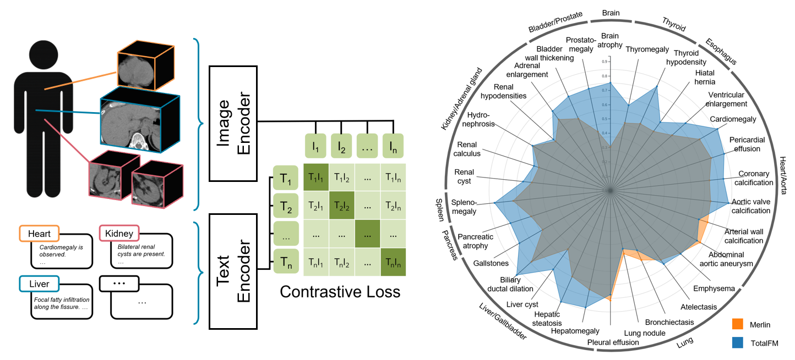

# TotalFM: An Organ-Separated 3D-CT Foundation Model Leveraging Large-Scale Routine Clinical Radiology Data

TotalFM generates organ-level embeddings from CT images. The model was trained via contrastive learning on 286,000 CT series from 8 institutions in the J-MID database, comprising 400,000 organ-level volume–text pairs. By feeding organ-segmented CT volumes (produced by TotalSegmentator) into the image encoder, TotalFM generates per-organ embeddings that can be used for disease classification, image-text retrieval, and similarity search.



## News
- **[2026.7.2]** 🎉 TotalFM has been accepted to MICCAI 2026!
- **[2026.5.20]** We plan to release TotalFMv2 in October 2026, featuring a fourfold increase in training data, improvements to the data pipeline, and enhanced model performance.
- **[2026.5.20]** Code and the model (English version) have been released!

## Installation

Clone the repository and install dependencies:

```bash
git clone https://github.com/jichi-labo/TotalFM.git
cd TotalFM
pip install -e .
```

Model weights are downloaded automatically from HuggingFace on first use.

## Usage

### CLI

#### Get Image Embeddings

First obtain a TotalSegmentator segmentation (>= v2.10.0, `total` task) for your CT volume:

Then extract organ-level embeddings:

```bash
totalfm -i path/to/ct_volume.nii.gz -s path/to/segmentation.nii.gz -o outputs/image_embeddings.npz
```

The output `.npz` file contains one 768-dimensional embedding per detected organ:

```
{
    "liver":   array([0.1, 0.2, ..., 0.512]),  # shape (768,)
    "spleen":  array([0.1, 0.2, ..., 0.512]),
    ...
}
```

#### Get Text Embeddings

Single text string:

```bash
totalfm -t "Liver with metastasis" -o outputs/text_embeddings.npz
```

Multiple texts via JSON file:

```bash
totalfm -t path/to/texts.json -o outputs/text_embeddings.npz
```

`texts.json` format:

```json
{
    "texts": [
        "Liver with metastasis",
        "Kidney with cyst"
    ]
}
```

The output `.npz` file maps each text to a 768-dimensional embedding:

```
{
    "Liver with metastasis": array([0.1, 0.2, ..., 0.512]),
    "Kidney with cyst":      array([0.1, 0.2, ..., 0.512]),
    ...
}
```

#### Optional CLI flags

| Flag | Description |
|---|---|
| `--device` | PyTorch device (`cuda`, `cpu`). Defaults to CUDA if available. |
| `--weights` | Path to a custom model checkpoint. |

---

### Python API

```python
from totalfm import TotalFM

# Initialize model (weights are downloaded automatically on first run)
model = TotalFM()

# --- Image embeddings ---
image_embeddings = model.encode_image(
    ct_path="path/to/ct_volume.nii.gz",
    seg_path="path/to/segmentation.nii.gz",
)
# image_embeddings["liver"] -> np.ndarray of shape (768,)

# --- Text embeddings ---
# Single string
text_embeddings = model.encode_text("Liver with metastasis")

# List of strings
text_embeddings = model.encode_text(["Liver with metastasis", "Normal liver"])

# JSON file
text_embeddings = model.encode_text("path/to/texts.json")

# text_embeddings["Liver with metastasis"] -> np.ndarray of shape (768,)

# --- Similarity ---
sim = model.compute_similarity(
    image_embeddings["liver"],
    text_embeddings["Liver with metastasis"],
)
print(f"Similarity: {sim:.4f}")
```

For large-scale processing, reuse the same `TotalFM` instance to avoid reloading the model on every call:

```python
from totalfm import TotalFM

model = TotalFM(device="cuda")

results = []
for ct_path, seg_path in ct_seg_pairs:
    embs = model.encode_image(ct_path, seg_path)
    results.append(embs)
```

#### Calculate Similarity Manually

Embeddings are L2-normalized, so the dot product equals cosine similarity:

```python
import numpy as np

image_embeddings = np.load("outputs/image_embeddings.npz", allow_pickle=True)
text_embeddings  = np.load("outputs/text_embeddings.npz",  allow_pickle=True)

image_embedding = image_embeddings["liver"]
text_embedding  = text_embeddings["Liver with metastasis"]

sim = image_embedding @ text_embedding.T
print(f"Similarity: {sim}")
```

## Limitations

- This model is the English version of TotalFM, trained on radiology reports translated from Japanese. Translation artefacts may reduce accuracy.
- It is strongly recommended to input organ-specific text rather than full radiology reports.

## Citation

If you use this code or model, please cite:

```bibtex
@misc{yamamoto2026totalfm,
      title={TotalFM: An Organ-Separated 3D-CT Foundation Model Leveraging Large-Scale Routine Clinical Radiology Data},
      author={Kohei Yamamoto and Tomohiro Kikuchi},
      year={2026},
      eprint={2601.00260},
      archivePrefix={arXiv},
      primaryClass={cs.CV},
      url={https://arxiv.org/abs/2601.00260},
}
```

## License

The source code is released under the **Apache License 2.0**.

The pretrained model weights are provided for **research purposes only**.

## Acknowledgements

This work uses [TotalSegmentator](https://github.com/wasserth/TotalSegmentator) for organ segmentation.
The text encoder is based on [Alibaba-NLP/gte-modernbert-base](https://huggingface.co/Alibaba-NLP/gte-modernbert-base).
We thank the radiology departments that contributed to the J-MID database.
